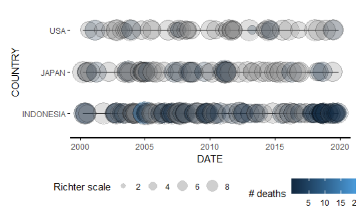
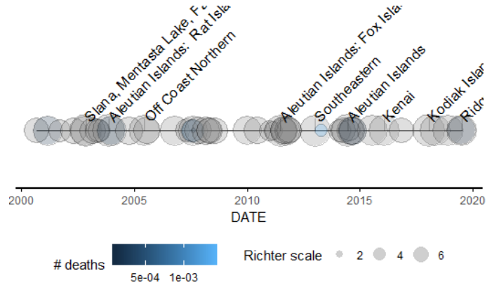
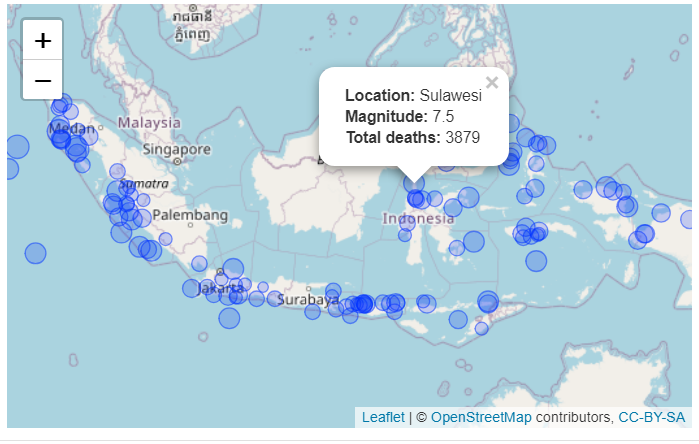

# earthquake

<h1><b>A package for NOAA data</b></h1>

<b>This package has the following usage</b>:
 &emsp;Clean and Visualize NOAA Earthquake Data of Countries.
 &emsp;Create timeline plot and interactive map with annotations.

<b>Functions</b>:
 &emsp;eq_location_lean(): strips out country name out of location name.
 &emsp;eq_clean_data(): cleans data for plotting.
 &emsp;geom_timeline(): new geom of a timeline plot.
 &emsp;geom_timeline_label(): new geom of labels for the timeline plot.
 &emsp;eq_map(): build an interactive map.
 &emsp;eq_create_label(): generate labels for the map.

<b>Example: timeline plot</b>

<b>Example: annotated interactive map</b>

